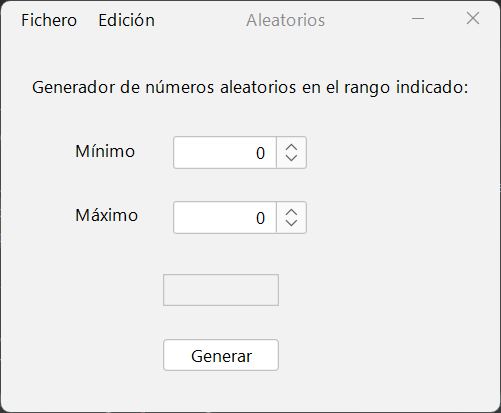

# Práctica 2.5 Generador de números aleatorios

Crea un proyecto llamado *practica2-5* en la carpeta SOL de github. Utiliza *branches* para delimitar los cambios que vayas haciendo.

## Parte 1

Crea un generador de números aleatorios gráfico. Utiliza el elemento *JSpinner* que mostrará el número aleatorio generado entre esos dos números en un campo *JTextField* al pulsar el botón generar.

La ventana deberá tener además un **menú** con los elementos Fichero y Edición. El menú fichero deberá tener un elemento salir y el menú *Edición* un elemento que permita reiniciar el contenido de los campos de la ventana.

Ayúdate de la función `Math.random()` entre dos números o de la clase `radom` así como de una **clase auxiliar** para realizar dichos cálculos.

```java
Math.random() * (max - min + 1) + (min)
```

```java
Random rnd = new Random();
rnd.nextDouble() * max + min

```

En esta práctica deberás además de empaquetar en un fichero **jar** el ejercicio



## Parte 2

Divide el proyecto en dos paquetes diferenciados según su función: *VistaControlador* y *Modelo*

Mejora el ejercicio anterior agregando un *checkbox* que en caso de estar marcado solo permita mostrar números **primos** entre los valores requeridos.

Agrega en el *menú edición* los siguentes elementos: 

- Una opción llamada **historial** que permita ver los últimos números generados en una ventana modal (*JDialog*) usando una lista (*JList*). 
- Una opción para **guardar** el historial del listado generado en un fichero de texto mediante un *JFileChooser*. Se deberá verificar si ya existe un fichero con el mismo nombre antes de sobreescribirlo.
- Otra última opción llamada *borrar todo* para eliminar el listado guardado del historial.  

> Nota: No olvides en tu proyecto agregar el fichero **jar** precompilado.

## Pruebas (testing)

Crea el fichero de pruebas en la carpeta *TEST* del repositorio en un fichero llamado *resultado_pruebas.md*.

| ID Caso Prueba | Descripción Caso de Prueba                     | Entrada                                 | Salida Esperada                                                           | Resultado   |
|----------------|-----------------------------------------------|-----------------------------------------|---------------------------------------------------------------------------|-------------|
| 01             | Comprobación del botón "Generar"               | Escribir valores en mínimo y máximo     | Se genera un número aleatorio entre los valores indicados                  | OK/No cumple|
| 02             | Comprobación valores mínimo y máximo           | Escribir valores en mínimo y máximo     | Se comprueba que el rango mínimo sea menor que máximo                      | OK/No cumple|
| 03             | Comprobación checkbox "Sólo números primos"    | Escribir valores en mínimo y máximo     | Se comprueba que se generan números primos aleatorios entre los valores indicados | OK/No cumple|
| 04             | Comprobación del historial                     | Abrir ventana desde el menú edición > historial | Se muestra un historial de todos los valores mostrados en una lista JList | OK/No cumple|
| 05             | Comprobación guardado                          | Abrir desde el menú fichero > guardar   | Se muestra un JFileChooser para elegir dónde guardar un fichero con el historial de números generados | OK/No cumple|
| 06             | Comprobación duplicados                        | Abrir desde el menú fichero > guardar   | Se verifica que el fichero a guardar no exista ya, en cuyo caso pregunta si se desea sobrescribir | OK/No cumple|
| 07             | Estructura de proyecto                        | -   | División del proyecto en paquetes | OK/No cumple|
| 08             | Comprobación fichero jar                        | Proyecto a empaquetar   | Se genera y prueba el fichero jar empaquetado | OK/No cumple|
| 09             | Creación de branches                        | Parte 1 y parte 2   | Se crean al menos dos branches en el repositorio github | OK/No cumple|
 
## Parte 3 (opcional)

Agrega dos **pestañas** (*JTabbedPane*), una en la que se muestren los números primos anteriores y otra en la que se pueda cargar una imagen haciendo click sobre un JLabel.


